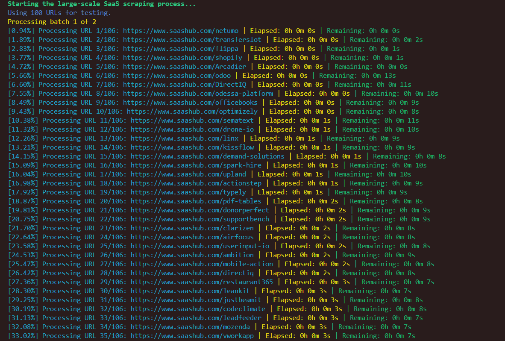

# saashub-scraper-200k-listings

A Node.js-based web scraper designed to extract data from approximately 200,000 SaaS product listings on saashub.com.



## Features

- Downloads and processes multiple XML sitemaps from saashub.com
- Extracts and deduplicates URLs from sitemaps
- Processes URLs to remove '-alternatives' and '-status' suffixes
- Batched scraping of SaaS product information
- Rate limiting to respect server constraints
- Error handling and retry mechanism for failed requests
- Progress tracking with time estimates
- Outputs data in both CSV and JSON formats
- Resumable scraping process in case of interruptions

## Prerequisites

- Node.js (version 14 or higher recommended)
- npm (usually comes with Node.js)

## Installation

1. Clone the repository:
   ```
   git clone https://github.com/yourusername/saashub-scraper-200k-listings.git
   cd saashub-scraper-200k-listings
   ```

2. Install dependencies:
   ```
   npm install
   ```

## Usage

1. Download and process sitemaps:
   ```
   node sitemap_downloader.js
   ```
   This script will:
   - Download and decompress XML sitemaps
   - Extract URLs from each sitemap
   - Process and deduplicate URLs
   - Save the final list of unique URLs to `sitemap_urls/all_urls.json`

2. Run the main scraper:
   ```
   node main.js
   ```
   The scraper will process URLs from `all_urls.json` and store the results in the `scraping_results` directory.

## Configuration

Adjust the following constants in `main.js` to customize the scraper's behavior:

- `BATCH_SIZE`: Number of URLs to process in each batch
- `RECORDS_PER_FILE`: Number of records per output file
- `RATE_LIMIT`: Maximum number of requests per second

## Output

The scraper generates two types of output files in the `scraping_results` directory:

- CSV files (`saas_data_X.csv`)
- JSON files (`saas_data_X.json`)

Where `X` is an incrementing number for each batch of results.

## Error Handling

Errors encountered during scraping are logged to `error_log.json` in the project root. The scraper includes a retry mechanism for failed requests.

## Contributing

If you'd like to contribute to this project, please fork the repository and submit a pull request.

## Example Data

🔍 Check out real examples of scraped SaaS listings here:

[**View Sample Data**](https://api.npoint.io/8c43e9e9678a1271b5ec)

This link provides real examples of the structured data extracted from saashub.com, giving you an idea of the information available through this scraper.

## Disclaimer

This project is for educational purposes only. Please use responsibly:

- Respect website terms of service and robots.txt files.
- Use appropriate rate limiting to avoid server strain.
- Do not use scraped data for commercial purposes without permission.
- The creators are not responsible for any misuse of this tool.

By using this scraper, you agree to these terms.